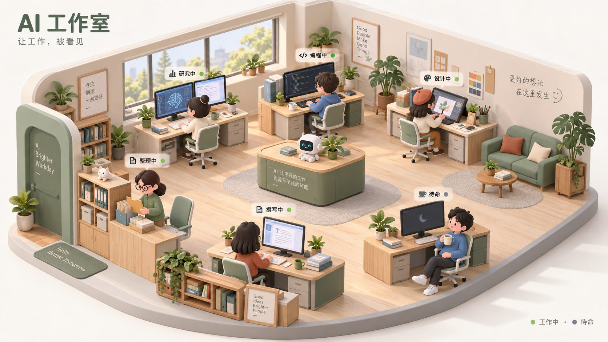

# DSH 3D AI 工作室插件｜产品构想文档

> 文档状态：第 1–28 节保留产品初始构想；第 29 节为已确认的视觉方向，第 30 节为已确认的技术路线与实施范围。存在差异时，以第 29–30 节为第一版实施依据。技术方向已获用户认可，接口可用性和两端兼容性仍须通过原型验证。

详细任务拆分、里程碑、工期估算与验收标准见[开发规划](docs/开发规划.md)。

## 1. 项目概述

### 1.1 项目暂定名
暂未确定。

项目核心概念：

**将 DSH 原本以文字、日志、状态信息为主的 AI 信息流，转化为一个实时运行的 3D 数字工作室。**

用户安装的每一个 DSH 插件，都将在 3D 工作室中对应一个“数字工作人员”与独立工位。

当插件被调用时，对应工作人员开始工作；当插件调用频率提高、任务压力增加时，工作人员的动作、工位状态和环境表现也随之增强。

用户因此可以像观察一家公司运行一样，直观地看到自己的 AI 系统正在如何工作。

---

# 2. 产品愿景

传统 AI 工具中，大量工作发生在用户不可见的后台。

用户通常只能看到：

- 正在思考
- 正在调用工具
- 正在搜索
- 正在处理
- 正在生成
- 调用完成
- 调用失败

这些信息虽然能够描述系统状态，但缺少直观感、参与感和趣味性。

本项目希望将这些抽象信息转化成一种新的交互形式：

> **让用户“看见 AI 在工作”。**

最终希望形成一个：

**AI 工作流可视化 + 插件状态监控 + 3D 数字办公室 + 轻度经营感**

融合的 DSH 插件。

它不只是一个 3D 皮肤，而是 DSH 的一个“可视化工作现场”。

---

# 3. 核心产品定位

项目不应仅仅定位为：

> “给 DSH 加一个好看的 3D 房间。”

更合适的定位是：

> **DSH 的 3D AI 工作流可视化控制台。**

或者：

> **把用户的 AI 插件系统变成一支可以被看见的数字团队。**

核心关键词：

- AI 工作流可视化
- 插件状态可视化
- Agent Observability
- 3D Workspace
- Digital Team
- AI Office
- AI 工作室
- 实时状态映射

---

# 4. 产品解决的问题

## 4.1 AI 工作过程过于枯燥

当前 AI 的大量反馈仍然表现为：

文字、加载动画、日志、状态标签。

对于普通用户来说缺少趣味性。

通过 3D 场景，可以让等待过程本身产生观看价值。

---

## 4.2 AI 工作过程存在明显黑箱感

用户往往不知道：

- 哪个插件正在运行
- 哪个插件调用最多
- 哪一步最耗时间
- 哪个插件发生错误
- 当前到底卡在哪里
- 一个复杂任务调用了哪些能力

3D 工作室可以成为用户理解整个系统状态的入口。

---

## 4.3 插件缺乏“存在感”

用户安装十几个插件之后，这些插件往往只是设置页面中的一个名称。

插件之间缺少明显的角色差异。

本项目将：

**插件 → 工种 → 工作人员 → 工位**

形成映射。

从而让每个插件在用户心中建立明确形象。

---

## 4.4 AI 工具缺少持续陪伴感

传统 AI 是：

用户提问 → AI 回答 → 结束。

3D 工作室则可以持续存在。

用户每次打开 DSH，都像进入自己的数字办公室。

随着插件越来越多，工作室也逐渐成长。

---

# 5. 核心世界观

用户拥有一家属于自己的 AI 数字工作室。

其中：

**用户**
= 工作室负责人 / Boss

**DSH / 主模型**
= 总负责人 / 调度中心

**插件**
= 不同岗位的专业工作人员

**Plugin Call**
= 工作任务

**调用频率**
= 工作负荷

**任务成功**
= 完成工作

**任务失败**
= 工作异常

**插件安装**
= 新员工入职

**插件卸载**
= 员工离职

**插件禁用**
= 暂时离岗

**插件更新**
= 员工升级 / 工位升级

这样可以把原本非常技术化的插件系统转化成用户容易理解的概念。

---

# 6. 核心体验

用户安装插件之后第一次进入 3D 工作室。

例如当前安装了：

- 浏览器插件
- 文件插件
- 代码插件
- 图片插件
- 记忆插件

工作室中便存在五名工作人员。

用户向 DSH 输入：

“帮我研究最近一个 AI 产品，然后整理成文档。”

任务开始。

主 AI 接收到任务。

随后：

浏览器工作人员开始快速操作电脑。

文件工作人员开始整理资料。

记忆工作人员从档案柜寻找相关内容。

最终文档插件工作人员开始编辑文件。

整个过程中，用户无需阅读底层日志，也可以大致理解：

> 我的 AI 团队正在做什么。

---

# 7. 插件 → 职业映射

不同类型的插件拥有不同工作人员形象。

例如：

## 浏览器 / 搜索插件

职业：

- 情报员
- 研究员

工作动画：

- 浏览网页
- 快速切换多个屏幕
- 查看地图
- 搜索资料
- 阅读新闻

工位元素：

- 多显示器
- 浏览器窗口
- 地图
- 信息墙

---

## 文件插件

职业：

档案管理员。

动作：

- 翻阅文件
- 整理资料
- 搬运文件夹
- 将资料放入档案柜

工位：

- 文件柜
- 文件架
- 打印机
- 文档堆

---

## 编程插件

职业：

软件工程师。

动作：

- 快速敲键盘
- 查看代码
- 调试程序
- 编译

工位：

- 多显示器
- Terminal
- IDE
- 开发设备

---

## Terminal / 系统插件

职业：

运维工程师。

动作：

- 查看服务器
- 输入命令
- 处理系统异常

---

## 图像生成插件

职业：

设计师。

动作：

- 绘画
- 操作数位板
- 修改图片
- 查看设计稿

---

## 记忆插件

职业：

档案研究员 / 图书管理员。

动作：

- 从档案柜寻找资料
- 阅读旧资料
- 整理卡片
- 将信息交给其他员工

---

## 邮件插件

职业：

行政 / 通讯专员。

动作：

- 查看邮件
- 回复消息
- 整理信件

---

## 日历插件

职业：

调度员。

动作：

- 查看日程
- 安排会议
- 在时间表中调整任务

---

# 8. 插件状态系统

整个产品最核心的技术逻辑之一：

**插件运行状态 → 3D 工作人员行为。**

建议设计统一状态层。

## Idle

插件当前没有被调用。

工作人员表现：

- 坐在工位
- 喝咖啡
- 看屏幕
- 轻微待机动作
- 整理桌面

---

## Working

插件正在执行任务。

工作人员：

- 开始操作电脑
- 打字
- 查看资料
- 使用对应职业动作

---

## Busy

插件短时间出现大量调用。

工作人员：

- 动作明显加快
- 同时操作多个屏幕
- 桌面出现更多文件
- 工作灯亮起

---

## Overloaded

插件出现极高负载。

例如：

- 高并发
- 大量排队
- 长时间任务

表现：

- 工作人员明显忙碌
- 多窗口同时运行
- 桌面资料大量增加
- 环境出现高负载提示

但表现应该有趣，而不是制造紧张感。

---

## Success

完成重要任务。

工作人员：

- 打勾
- 伸懒腰
- 做出短暂完成动作
- 将文件交付

动画控制在很短时间内。

---

## Error

插件运行失败。

表现：

- 屏幕红色提示
- 工位警示灯
- 工作人员查看错误
- Debug 动作

用户点击即可查看：

具体错误日志。

---

## Disabled

插件被关闭。

表现：

- 工位灯关闭
- 工作人员离开
- 椅子为空

---

## Updating

插件正在更新。

表现：

- 工位设备维护
- 更换电脑设备
- 工作人员整理工作台

---

# 9. 工作强度系统

插件工作人员不能只有“工作 / 不工作”两个状态。

可以设计一个：

**Workload：0–100**

由以下数据计算：

- 单位时间调用次数
- 当前并发任务
- 平均任务耗时
- 当前任务持续时间
- 任务队列数量
- Token 使用量
- 插件自身执行状态

例如：

0–20：

轻度工作。

20–50：

正常工作。

50–80：

忙碌。

80–100：

高负载。

3D 表现随 Workload 连续变化，而不是突然切换。

例如：

工作负荷越高：

- 打字速度越快
- 屏幕数量越多
- 动作频率越高
- 桌面信息越丰富
- 工位灯光越明显

这样用户一眼就能看到：

> 哪些插件才是本次任务真正的主力。

---

# 10. 工作室总控中心

除了插件员工之外，整个办公室可以存在一个核心区域：

## AI 总控台

代表：

DSH / 当前主 AI。

当用户发送任务之后：

任务首先进入中央总控台。

主 AI 根据需求调用不同插件。

视觉上可以表现为：

用户请求

↓

中央 AI

↓

分配工作

↓

插件工作人员开始工作

↓

结果返回

↓

中央 AI 汇总

↓

最终输出

这会让复杂 Agent 工作流变得非常容易理解。

---

# 11. 3D 工作室 UI 结构

主界面建议分为两部分。

## 3D 区域

展示：

- 房间
- 工作人员
- 工位
- 当前任务
- 插件运行状态
- 环境反馈

---

## 信息面板

点击某个员工后弹出。

显示：

插件名称

插件图标

当前状态

当前任务

本次调用次数

今日调用次数

平均耗时

最近调用时间

最近任务

成功率

错误信息

---

# 12. 点击工作人员后的交互

点击工作人员，可以进一步执行：

- 查看当前任务
- 查看历史调用
- 查看输入摘要
- 查看输出摘要
- 查看错误日志
- 暂停插件
- 禁用插件
- 打开插件设置
- 查看插件详细信息

这样 3D 工作室就不仅是装饰层。

它同时成为：

**插件管理中心。**

---

# 13. 任务实时可视化

未来可以进一步实现：

一个复杂任务被拆成多个工作步骤。

例如：

用户：

“帮我调查一个项目并整理成 PPT。”

视觉表现：

研究员开始搜索

↓

档案管理员整理信息

↓

分析员工处理信息

↓

设计员工制作图片

↓

文档 / PPT 员工制作文件

↓

总控 AI 汇总

任务之间可以通过：

- 文件
- 光点
- 数据包
- 文件夹

等视觉元素进行传递。

从而让用户真正看到：

**AI 工作流。**

---

# 14. 工作回放系统

后续高级功能。

任务完成之后：

用户点击：

“工作回放”

系统重新播放本轮任务的调用流程。

例如：

00:01 搜索插件启动

00:04 搜索完成

00:05 文件插件读取资料

00:09 AI 分析

00:14 图片插件生成图片

00:21 文档插件开始制作

00:30 输出完成

用户可以直接看到整个任务的执行路径。

该功能具有两种价值：

### 娱乐价值

像观看自己的 AI 团队工作。

### 调试价值

开发者可以直观看到：

哪个步骤最慢。

哪个插件经常报错。

哪个插件调用异常。

---

# 15. 工作室成长系统

项目后期可以加入轻度成长元素。

注意：

成长系统不应该成为复杂游戏。

主要用于增强持续使用体验。

例如：

插件使用次数增加：

普通电脑

→ 双屏

→ 三屏

→ 高级工作站

工作人员也可以拥有：

- 新动画
- 新办公用品
- 工位装饰
- 小型奖杯

工作室整体也可以随着插件数量增加：

小办公室

↓

工作室

↓

大型开放办公室

↓

AI 公司

但成长系统最好保持：

**自动产生。**

不要要求用户频繁点击升级。

否则容易变成另一个复杂的经营游戏。

---

# 16. 工作室环境反馈

系统整体运行情况可以映射到办公室环境。

例如：

正常：

办公室安静运行。

高负载：

更多屏幕亮起。

发生大量任务：

工作室明显热闹。

系统出现错误：

某个区域出现红色警告。

所有任务结束：

工作人员逐渐恢复待机。

用户因此无需查看数据，也可以通过环境理解整体状态。

---

# 17. 用户自定义

后期可以支持：

### 工作室主题

例如：

- 科技办公室
- 游戏工作室
- 极简办公室
- 赛博实验室
- 像素办公室

### 员工外观

用户可以选择：

- 人类角色
- 机器人
- Q版员工
- 小动物
- 像素人物

### 工位布局

用户能够调整：

- 员工位置
- 工位排列
- 房间布局

但初期不建议加入复杂装修系统。

---

# 18. MVP 第一版本

第一版最大的目标不是：

做一个完整 3D 世界。

而是验证：

> 用户是否喜欢“看 AI 工作”。

MVP 建议只实现：

## 3D 房间

一个固定办公室。

---

## 插件自动识别

读取当前已经安装的插件。

---

## 插件生成员工

每个插件：

一个工位 + 一个工作人员。

---

## 三种主要状态

仅实现：

Idle

Working

Error

---

## 工作强度

根据插件调用频率：

改变工作人员动作速度。

---

## 点击员工

能够看到：

- 插件名称
- 当前状态
- 调用次数
- 当前任务
- 最近结果

---

## 基础插件事件监听

实现：

插件调用开始

插件调用结束

插件调用失败

---

# 19. MVP 明确不做

为了避免第一版开发失控，暂时不要加入：

- 复杂经营系统
- 房间装修
- 员工培养
- 完整经济系统
- 大量人物模型
- 多层建筑
- 联机
- 社交
- 排行榜
- 复杂 AI NPC
- 大量剧情
- 超高精度 3D 模型

第一版的核心必须始终保持：

> **AI 工作状态可视化。**

---

# 20. 技术架构初步设想

整个系统可以拆成三层。

---

## 第一层：DSH Event Layer

负责获取 DSH 状态。

包括：

Plugin Installed

Plugin Removed

Plugin Enabled

Plugin Disabled

Plugin Call Start

Plugin Call End

Plugin Call Error

Tool Call

Task Start

Task End

---

## 第二层：Workspace State Engine

负责将 DSH 原始事件转化成统一状态。

例如：

```text
Plugin
 ├── ID
 ├── Name
 ├── Type
 ├── Status
 ├── Workload
 ├── CurrentTask
 ├── CallCount
 ├── ErrorCount
 ├── AverageLatency
 └── LastActive
```

3D 层只读取这个状态。

而不直接处理 DSH 原始日志。

---

## 第三层：3D Rendering Layer

负责：

- 场景
- 人物
- 动画
- 工位
- 状态反馈
- 点击交互

前端技术可以考虑：

Three.js

或者：

React + React Three Fiber

UI 面板可以继续使用普通 HTML / React。

3D 只负责最需要视觉化的部分。

---

# 21. 动画系统设计

每个角色使用统一动画状态机。

例如：

Idle

↓

StartWork

↓

Working

↓

Busy

↓

Finish

↓

Idle

以及：

Working

↓

Error

↓

Debug

↓

Idle

大量插件可以复用动画。

不同职业仅增加少量专属动作。

这样可以显著降低开发成本。

---

# 22. 性能原则

3D 必须服务于 DSH。

不能影响正常 AI 使用。

因此需要：

- 使用低模角色
- 控制材质复杂度
- 减少动态光源
- 降低后台刷新频率
- 页面不可见时自动降低帧率
- 用户可以关闭 3D 模式
- 支持性能模式

最终目标：

即使存在几十个插件，也不应该明显影响系统使用。

---

# 23. 产品设计原则

整个项目应该遵守几个原则。

## 第一原则

**先有信息价值，再有视觉效果。**

---

## 第二原则

任何动画都应该代表真实系统状态。

避免纯随机动作干扰用户判断。

---

## 第三原则

用户应该在 3 秒内看懂：

谁正在工作。

---

## 第四原则

用户应该在 10 秒内找到：

哪个插件出问题了。

---

## 第五原则

3D 不应该增加操作复杂度。

---

# 24. 最大产品风险

## 风险一：沦为视觉玩具

解决：

让点击员工能够看到真实调用数据。

---

## 风险二：使用几天后失去新鲜感

解决：

加入真正有价值的：

状态监控

任务回放

调用分析

插件管理。

---

## 风险三：DSH 无法提供足够事件接口

这是项目最关键的技术风险。

开发前需要优先确认：

DSH 插件能否监听：

插件调用

工具调用

状态

错误

调用耗时

插件安装列表

如果无法获取这些数据，需要设计替代方案。

---

## 风险四：3D 性能太重

解决：

低模风格 + 动画复用 + 状态驱动。

---

# 25. 开发优先级

## P0

必须实现：

- 获取插件列表
- 获取插件调用状态
- 建立插件状态模型
- 3D 房间
- 插件员工生成
- Idle / Working / Error
- 点击查看状态

这些功能决定整个项目是否成立。

---

## P1

第二阶段：

- Workload 工作强度
- 不同插件职业
- 调用统计
- 当前任务显示
- 插件管理
- Busy 动画
- 工位特色

---

## P2

后期：

- 工作回放
- 工位升级
- 工作室成长
- 多主题
- 用户自定义
- 工作流程可视化
- 分享工作室

---

# 26. 第一版理想 Demo

一个能够传播的视频 Demo：

用户打开 DSH。

进入一个安静的 3D 工作室。

里面有：

代码工程师

研究员

档案管理员

设计师

用户发送：

“帮我查一下某个项目，分析源码，然后给我写一份报告。”

中央总控台亮起。

研究员开始疯狂操作屏幕。

档案管理员开始寻找资料。

代码工程师开始敲代码。

研究员完成任务之后停下。

代码工程师继续工作。

随后报告员工开始整理文档。

所有员工逐渐停止。

中央总控台显示：

TASK COMPLETE。

整个过程可能只有几十秒。

但用户第一次看到时会立刻理解这个项目的价值：

> **原来我的 AI 真的像有一支团队在替我工作。**

---

# 27. 项目的长期方向

如果项目发展顺利，它最终不一定只是：

DSH 的一个 3D 插件。

更大的方向可能是：

**AI Agent 可视化工作空间。**

未来无论底层接入：

DSH

OpenAI

Claude

Codex

MCP

各种 Agent

都可以统一映射为：

工作人员

任务

岗位

工作流。

最终形成：

> 一个属于用户自己的“数字 AI 公司”。

---

# 28. 产品核心总结

这个项目最重要的并不是：

3D。

也不是：

小人动画。

真正的核心是：

> **将 AI 原本不可见的工作过程，转化为用户可以理解、观察和管理的数字工作现场。**

3D 是这个理念最有趣、最直观的载体。

项目成功之后，用户看到的不再是：

“调用 Browser Tool……”

而是：

**研究员站起来开始工作了。**

不再是：

“Tool Error”。

而是：

**某个工位亮起红色警告。**

不再是：

“Running 7 Tools”。

而是：

**整个办公室忙了起来。**

这才是该产品真正有辨识度的地方。

---

# 29. 已确认的视觉方向

确认日期：2026-09-11。

用户已确认采用下方概念图作为第一版的视觉基准：**温暖微缩工作室**。



该图由内置 ImageGen 生成，用于明确美术方向，不是已实现的运行截图。图中的员工数量、文字、具体家具摆放和机器人造型不构成独立功能承诺；实际布局应适应插件数量与可用显示空间。

## 29.1 整体感受

以舒适、温暖、清楚、适合持续观看为优先目标。采用柔和轮廓的低模微缩办公室，保留人物的亲和感与职业辨识度。

## 29.2 配色与材质

- 主色：奶油白、浅木色、鼠尾草绿。
- 辅色：低饱和蓝色与少量陶土色。
- 材质：哑光墙面、浅木家具、柔和织物，避免强反光与过度写实的细节。
- 装饰：适量植物、书架和办公用品；落地时减少墙面标语及细碎装饰。

## 29.3 镜头与空间

- 默认采用固定斜俯视角，优先验证正交投影。
- 使用开放式剖面房间，保证员工和工位不被墙体遮挡。
- 工位采用模块化布局，留出清晰的通道与视觉间距。
- 中央调度区域保持适度体量，不遮挡员工与工作信息。

## 29.4 角色与状态

- 使用比例统一、轮廓简洁的亲和角色，通过配色和职业道具区分岗位。
- 用屏幕、文件、数位板等道具传达工作类型。
- 用小型状态标签与局部灯光辅助识别状态，不能只靠颜色区分。
- 任务详情与错误内容优先放在普通信息面板，保持场景清爽。

## 29.5 灯光与动画

- 使用柔和日光、漫射照明和轻柔阴影，避免刺眼高光、强烈泛光及大面积霓虹效果。
- 待机动作轻缓、低频，不应被误解为正在执行任务。
- 工作期间通过打字、阅读、绘画等局部动作体现活动；工作强度变化保持平滑。
- 错误提示局限于对应工位，避免全场闪烁或制造紧张感。
- 页面隐藏时暂停渲染，提供减少动态效果的选项；具体性能预算由两端原型测试确定。

## 29.6 实现验收方向

优先保持概念图的色调、视角、空间疏密、角色亲和感和状态可读性。实际效果通过可运行原型在 Web 与桌面分别验证，尤其检查缩小窗口后的标签辨识度、遮挡、动画舒适度和性能。

---

# 30. 已确认的技术路线与实施计划

确认日期：2026-09-11。

用户已认可前述技术建议。项目采用 **TypeScript + React + Three.js / React Three Fiber**，以原生 DSH 插件形式接入，目标是使用一套核心代码同时支持 DSH Web 与官方桌面版。

本节是开发方向，不代表代码、插件安装或兼容性验证已经完成。具体 DSH 版本与依赖版本在接入原型阶段核对并锁定。

## 30.1 技术栈

| 部分 | 采用方案 | 作用与约束 |
|---|---|---|
| 开发语言 | TypeScript | 统一约束事件、调用记录、员工状态与宿主接口 |
| 信息面板 | React + CSS | 通过 DSH 官方 UI 扩展机制接入，承担详情、统计和操作入口 |
| 3D 场景 | Three.js + React Three Fiber | 将房间、员工、工位组织为可复用组件；验证与宿主 React 版本及模块加载机制的兼容性 |
| 3D 资产 | 低模模型，优先 GLB | 房间、家具、角色与动画模块化制作；资源随插件交付，加载路径须在两端验证 |
| 状态引擎 | 独立 TypeScript 模块 | 不依赖 3D 渲染，可同时接收真实事件和模拟事件，支持后续回放复用 |
| 宿主通信 | DSH 官方 Remote 接口与事件流 | 尽量沿用宿主传输能力，避免将固定 localhost 地址或额外 Web 服务作为核心前提 |
| 分发 | 预编译插件包 | 验证本地安装包后再考虑公开分发；前端与后端入口遵循目标 DSH 版本的打包要求 |

首版不预先引入额外数据库或复杂状态框架。先复用 DSH 可用的会话记录和客户端模型，只有出现明确缺口时再增加存储或依赖。

## 30.2 四层架构

```text
DSH 工具事件、会话记录、插件信息
                ↓
           DSH 接入层
                ↓
         工作室状态引擎 ← 模拟事件 / 测试记录
                ↓
       ┌────────┴────────┐
       ↓                 ↓
3D 房间、员工与动画   任务、统计与错误面板
```

### DSH 接入层

负责订阅真实活动、读取可用插件或能力信息、识别当前会话，以及将 DSH 数据规范化。DSH 版本变化尽量集中在这一层处理。

官方文档中已有 `tools/execute`、`tools/result` 和 `session/event` 等接入点。原型阶段需确认目标版本中各事件的语义、作用域、嵌套调用覆盖和取消行为。使用执行包装接口时保持正常调用链，不能让可视化处理阻塞或改变工具执行结果。

### 工作室状态引擎

以调用记录为依据计算员工状态、活动强度、统计和异常。状态更新与渲染分离，业务数据不会因动画播放、页面隐藏或帧率变化而改变。

### 3D 表现层

只消费适合展示的状态，负责模型、动画、灯光、选择反馈和视角。角色不直接读取日志，也不直接调用宿主接口。

### 信息面板

展示插件或能力名称、当前调用、调用次数、最近结果和错误。用户操作通过接入层转交宿主，避免组件自行实现通信或重复保存宿主权威状态。

## 30.3 Web 与桌面支持策略

两端支持是产品目标，不能将共用 Web UI 理解为所有插件天然完全兼容。

- 共用状态引擎、场景、动画、详情面板与事件规范。
- 通信、资源加载、UI 入口和插件管理优先使用两端共同提供的接口。
- 不预先开发两套实现；只在验证发现差异后增加必要的适配。
- 第一轮接入原型即测试两端，避免在完整场景制作后才发现宿主限制。
- 验证时记录 DSH 版本、运行平台和安装方式，后续兼容承诺限定在实际测试范围内。
- 核心体验在两端保持一致：观察工作、查看任务、定位错误。禁用、更新等管理操作按宿主实际开放的能力接入。

根据此前核对的官方主分支文档，桌面版拥有独立的插件环境和安装管理流程，且不提供普通 Web 服务；文档已列出依赖 HTTP 路由的功能差异。桌面发行版的编译产物、共享依赖及安装脚本也有要求，需以选定版本重新核对。

## 30.4 员工与插件、工具的映射

产品继续使用“插件对应员工”的表达，底层区分以下实体：

```text
安装包 → 插件实例 → 工具 → 工具调用
                         ↓
                    归属到展示员工
```

这是归属模型，不假设每一层都是一对一关系。

- 一个员工可以汇总同一插件或能力提供者的多个工具调用。
- 优先通过稳定标识、注册信息和明确元数据确认归属，不仅依赖名称猜测。
- 无法确认归属时显示工具名称及未归属状态，不能伪装成已识别插件。
- 主题、存储、底层服务等基础设施插件默认不生成普通员工工位。
- 工具可用列表与已安装插件列表分别处理，不能用前者代替后者。

工具到插件的可靠归属映射，是接入原型的关键验证项。

## 30.5 调用记录与员工状态

先记录每次调用，再派生员工表现。单个 `Working` 开关不足以表示并发活动。

建议的最小数据模型：

| 实体 | 主要信息 |
|---|---|
| 调用记录 | 会话标识、调用标识、工具名、员工归属、开始时间、结束时间、运行结果、错误摘要；可用时保留父调用关联 |
| 员工状态 | 稳定标识、显示名称、职业、当前运行调用集合、近期错误、调用统计、活动强度 |
| 工作室状态 | 当前观察范围、员工集合、选中员工、数据连接与同步状态 |

关键行为：

1. 同一员工同时执行三个调用，其中一个完成后仍应继续工作。
2. 一个调用失败、其他调用仍在执行时，保留工作表现，并叠加局部错误提示。
3. 调用取消、执行失败和正常完成分别记录，取消不能计为成功。
4. 以会话和调用身份关联事件，避免跨会话串线；重复事件不重复计数。
5. 页面重新打开或连接恢复时，先依据快照或可重建记录恢复状态，再接收增量更新。
6. 数据断开或不足时显示未知或同步中，不能直接把所有员工判定为待机或完成。

`Idle / Working / Error` 保留为首版主要视觉表现，但底层记录能够表达并发、取消与同步状态。完成动画可以短暂播放，不代替真实运行状态。

## 30.6 活动强度与统计口径

首版将 Workload 解释为 **活动强度**，采用当前并发调用数量与近期调用频率计算，具体窗口、权重和平滑参数通过原型调试确定。

- 该指标用于调节动画节奏与工位表现，不代表 CPU 使用率、真实资源饱和度或任务完成百分比。
- 耗时长不自动等于高负载；等待、排队、执行和异常在有数据支持时分别表达。
- 状态事件及时处理，视觉变化平滑过渡；动画逐帧更新不触发整个业务界面逐帧重算。
- 首版调用次数按当前会话统计；历史数据未完整加载时注明统计范围。
- 今日调用量、全局成功率、跨会话平均耗时等统计在具备完整数据后再增加。

本节收敛第 9、18、25 节的优先级：简单活动强度、当前任务与基础调用次数纳入 MVP；复杂负载指标和全局分析后续实现。

## 30.7 观察范围与 UI 入口

按此前推荐路线，第一版从 **当前会话工作室** 开始：切换会话时显示相应的工作活动。底层保留会话维度，为后续全局工作室汇总多会话活动做准备。

界面入口优先验证官方 Conversation View 或现有 Slot，确认能够承载完整工作室和详情面板后再确定具体布局。通过官方扩展机制挂载，不依赖修改宿主 DOM 的方式注入界面。

全局工作室后续需要补充多会话汇总、任务归属提示、后台订阅和统计范围设计。

## 30.8 3D 实现与性能原则

视觉遵循第 29 节和已确认概念图。

- 固定斜俯视角，优先正交投影；支持缩放、员工选择和有限视角调整。
- 首批制作一个房间、模块化工位与一套基础角色，通过配色和道具区分职业。
- 首批动画覆盖待机、工作和异常反馈，再逐步增加职业专属动作。
- 模型、材质和动画尽量复用，控制实时阴影、动态灯光与后处理。
- 页面隐藏时暂停渲染；可见但无动画变化时采用按需渲染。
- 长期静止与运行中的场景分别制定渲染策略；减少动态效果模式保持状态信息可读。
- 提供 3D 关闭或降级展示路径，确保核心任务信息仍然可用。
- 在代表性设备与插件数量下测量帧率、内存和响应表现后确定性能预算，不先承诺未经验证的容量。

## 30.9 开发与验证阶段

### 阶段一：接入原型

交付：最小可安装插件，带事件日志与基础状态面板。

验证：

- 两端插件安装、加载和 UI 挂载。
- 工具开始执行、最终成功或失败、调用取消及对应会话身份。
- 插件或能力列表与工具归属的实际可获取程度。
- 并发和嵌套调用能否被分别追踪，是否出现重复计数。
- 正常执行不受观察逻辑影响，插件卸载后订阅和资源得到清理。

这一阶段确认产品是否具备真实数据基础，并锁定目标 DSH 与关键依赖版本。

### 阶段二：体验原型

交付：一个工位、一个员工、详情面板及模拟事件入口。

验证：真实调用驱动动画；并发、失败、取消、切换会话和重新打开页面时表现正确；模型及资源在两端加载成功；视觉接近已确认概念图。

独立预览页用于快速调整美术和动画。模拟数据需明确标识，不能将演示活动混入真实监控；同一状态引擎接受模拟事件和实际接入事件。

### 阶段三：MVP

交付：多员工办公室、自动工位生成、主要状态、简单活动强度和基础详情面板。

验证：真实任务全过程可观察，错误可定位；窗口缩小后信息仍可辨认；Web 与桌面分别通过完整安装和运行验证。

MVP 验收关注：谁正在工作、谁发生异常、任务是否仍在进行，以及观看是否舒适。

### 后续阶段

逐步增加职业专属资产、插件管理、全局工作室、完整统计与回放，再考虑成长、多主题和自定义布局。首版不实现完整经营系统、复杂装修或大量独立角色模型。

## 30.10 验证方式

- 状态引擎用确定性的事件序列验证并发、乱序或重复通知、取消、错误和状态恢复。
- 模拟场景与采集记录用于复现问题；真实宿主联调用于验证接口及事件覆盖，二者不能互相替代。
- 每个阶段在 Web 与桌面检查对应功能；桌面开发启动通过后，仍需验证实际安装包路径。
- 3D 视觉检查覆盖默认视角、小窗口、角色遮挡、状态标签、动画节奏和性能模式。
- 测试重点放在状态正确性和宿主集成，低影响的纯装饰修改以视觉检查为主。

## 30.11 待原型确认的技术事项

以下事项需要实现和测试，不影响已经确认的主路线：

- 插件、工具、会话和嵌套调用之间的可靠关联方式。
- 当前版本中可用的 UI 挂载点和数据获取接口。
- 宿主 React 与 React Three Fiber 的依赖匹配及共享模块身份。
- 模型、纹理、动画资源在 Web 与桌面的打包和加载方式。
- 断线恢复、历史记录窗口与统计完整性。
- 需要的平台差异适配，以及哪些插件管理操作可由工作室发起。
- 最终资产复杂度、插件容量和性能预算。

## 30.12 技术依据

以下为讨论时查阅的官方资料。链接指向持续更新的文档或主分支；实现时应按锁定版本复核，不将主分支能力直接视为用户安装版本已经具备的能力。

- [DSH 架构与事件扩展](https://github.com/deepseek-ai/deepseek-harness/blob/master/docs/architecture.md)
- [DSH 工具执行与观察接口](https://github.com/deepseek-ai/deepseek-harness/blob/master/docs/subsystems/tools.md)
- [DSH 客户端架构与 Remote 通信](https://github.com/deepseek-ai/deepseek-harness/blob/master/docs/subsystems/web-client.md)
- [DSH Conversation 扩展](https://github.com/deepseek-ai/deepseek-harness/blob/master/docs/subsystems/conversation.md)
- [DSH UI Slots](https://github.com/deepseek-ai/deepseek-harness/blob/master/docs/subsystems/slots.md)
- [DSH 客户端模块加载](https://github.com/deepseek-ai/deepseek-harness/blob/master/docs/subsystems/client-modules.md)
- [DSH 官方桌面架构与打包约束](https://github.com/deepseek-ai/deepseek-harness/blob/master/apps/desktop/README.md)
- [DSH 插件发布指南](https://github.com/deepseek-ai/deepseek-harness/blob/master/docs/user/develop/basic/publish.md)
- [React Three Fiber 简介与版本匹配](https://github.com/pmndrs/react-three-fiber/blob/master/docs/getting-started/introduction.mdx)
- [React Three Fiber 性能指南](https://github.com/pmndrs/react-three-fiber/blob/master/docs/advanced/scaling-performance.mdx)
- [Three.js 官方文档](https://threejs.org/docs/)
