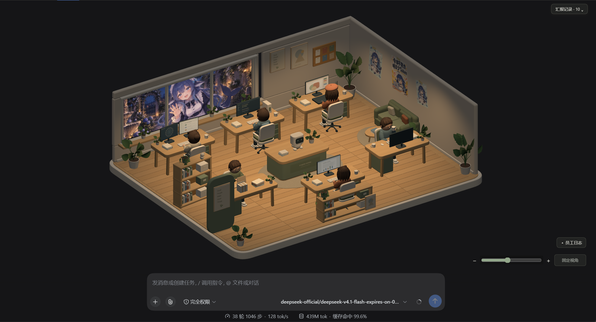
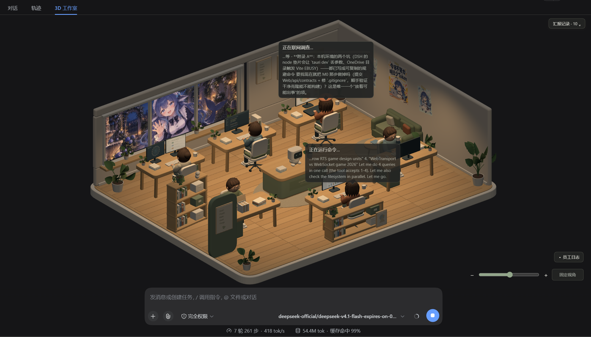

# DSH AI 工作室

把 DSH 的插件与模型调用过程**可视化成 3D 数字办公室**——**插件即员工、工位即岗位、调用即任务**。

六名员工各有固定岗位，谁在干活、在干什么、为什么这么干、最后交付了什么，一眼看得见。

**实机画面**（暗色主题 · 真实调用驱动 · 六名员工各就各位）：



---

## 安装（一条命令）

**前置**：官方宿主 `@deepseek-ai/dsh@0.1.5-rc.1`（宿主 React 18.3.1）。已经装过 DSH 就不用再装。

多数人是用 `npx @deepseek-ai/dsh web` 启动 DSH 的，那就用**同样的形式**装插件：

```bash
# 1) 装插件：一条命令，不需要任何授权（包里没有安装期脚本）
npx @deepseek-ai/dsh plugin --profile web add github:zkl22492-star/Toolfolk-for-DSH

# 2) 启动（就是你平时那条命令）
npx @deepseek-ai/dsh web --no-open
```

全局装过 `dsh` 的（`npm i -g @deepseek-ai/dsh`），把命令里的 `npx @deepseek-ai/dsh` 换成 `dsh` 即可，其余一字不差。

> `dsh web` 与 `npx @deepseek-ai/dsh web` 是 `--profile web` 的**硬编码别名**，所以插件命令里的 `--profile web` 指的就是同一个 profile。
> `npx` 若提示确认，加 `-y`：`npx -y @deepseek-ai/dsh plugin --profile web add …`。

然后用启动输出里带 `?token=` 的**完整地址**打开，
在视图切换器的「对话 / 轨迹」旁边切到 **「3D 工作室」**（标签就叫这个名，便于第一次找到）。

> 首次打开可能是空房间：**Web profile 下工具插件要等会话的 agent 启动才加载**——在对话里发一条消息，员工就上岗了。

**卸载**：`npx @deepseek-ai/dsh plugin --profile web remove toolfolk-for-dsh`（全局安装版把前缀换成 `dsh`）

### 其它安装方式

| 方式 | 命令（npx 形式；全局安装版把 `npx @deepseek-ai/dsh` 换成 `dsh`） | 是否需要授权执行作者代码 |
|---|---|---|
| **git 一条命令**（上面那种，推荐） | `npx @deepseek-ai/dsh plugin --profile web add github:zkl22492-star/Toolfolk-for-DSH` | **否**（包里没有 `prepare` 等安装期脚本，pnpm 不会拦） |
| 下载附件（适合网络不稳 / 离线） | 下载 [toolfolk-for-dsh-0.1.0.tgz](https://github.com/zkl22492-star/Toolfolk-for-DSH/releases/download/v0.1.0/toolfolk-for-dsh-0.1.0.tgz)，在下载目录执行 `npx @deepseek-ai/dsh plugin --profile web add ./toolfolk-for-dsh-0.1.0.tgz` | 否 |
| npm（尚未发布） | `npx @deepseek-ai/dsh plugin --profile web add toolfolk-for-dsh` | 否 |
| 锁定版本（可复现） | `npx @deepseek-ai/dsh plugin --profile web add "github:zkl22492-star/Toolfolk-for-DSH#<commit>"` | 否 |

### 安装注意

- ⚠️ 用**本地文件路径**安装时，路径**不要含空格**：`dsh plugin add` 会把路径按空格切开（实测 `L:/Toolfolk for DSH/…` 会被截成 `L:/Toolfolk`）。用 `./文件名` 这种相对路径最稳；`github:` 形式不受影响。
- 插件只读宿主事件，**不联网、不上传任何数据**；状态只写到本机（见下「许可、隐私与兼容」）。
- 实测（独立 profile，非本机默认 profile）：`add` → **不带 `--patch` 启动即自动加载**、资源从安装位置解析 → `remove`。

---

## 它长什么样

| 能力 | 说明 |
|---|---|
| **六个固定岗位** | 工位 = 岗位：①资料检索 ②撰写修改 ③联网调查 ④会话记忆 ⑤命令执行 ⑥协作调度。插件是岗位里的「承包方」，不占座 |
| **「正在做某事」** | 主文案由**真实参数**推出（如 `正在联网调查：<url>`），不是统计数字；未收录的工具另列"未归类"，不硬塞 |
| **思维流气泡** | 员工干活时头顶冒泡，第二行是**这次任务对应的模型推理原文**（先想后调，按调用归属）；干完停留一会儿淡出 |
| **交付纸** | 回答结束时一张微皱 A4 递到眼前（「老大请过目」+ 红章「已阅」）；可滚动看全文，点印章收起 |
| **员工日志** | 左下角，**头部固定**（收起按钮不会滚走）；按时间倒序列出调用事件与交付 |
| **汇报记录** | 右上角，**默认收起**；点开展开全部历史回答，**含插件启动前就存在的历史**（从会话完整日志回填） |
| **明暗主题** | 跟随宿主 `body[data-ds-dark-theme]`，颜色变量单一来源 |
| **总控台机器人** | 中央总控台上的 `Coordinator` 即模型本人，按阶段做程序化动作 |

员工干活时头顶冒泡，气泡第二行就是**这次任务对应的模型推理原文**（实机截图中两个工位正在同时干活）：



更多截图见 [`docs/assets/`](docs/assets)。

## 文档

- [**接入能力验证结论**](docs/integration-findings.md) —— 官方接口实测：可用接口、关键约束、已知差异与每项证据
- [开发规划与里程碑](docs/开发规划.md) —— 任务拆分、验收标准、收尾记录
- [打包清单](docs/打包清单.md) —— 打包/分发/验收细节
- [产品构想与技术路线](DSH%203D%20AI%20工作室插件｜产品构想文档.md)
- [资产说明](assets/3d/v2/README.md) · [资产清单](assets/3d/v2/manifest.json)

## 许可、隐私与兼容

- **许可**：**MIT**（[LICENSE](LICENSE)，`Copyright (c) 2026 浊客er`）。
- **第三方声明**：[THIRD-PARTY-NOTICES.md](THIRD-PARTY-NOTICES.md)。客户端产物内联了 **three.js（MIT）**，
  而打包器会剥掉代码里的许可注释，所以**分发时必须随包附带该文件**（产物头部也留了指引）。
- **资产来源**：`assets/3d/v2/*.glb` 由本项目脚本**程序化生成**；`assets/art/studio-v1/*.png` 为**项目作者自制**。不含第三方素材。
- **隐私**：插件只读宿主事件（`tools/execute`、`tools/result`、`session/event`、`agent/assistant-stream`），
  不修改工具调用链、不拦截返回值；状态只写到**本机文件**，**不发送任何数据到外部**：
  - `<用户目录>/.dsh/studio/state.json`（可用 `DSH_STUDIO_STATE` 覆盖）；
  - 会话工作区里的一份 `.dsh-studio/state.json`——**纯派生数据、可随时删除**，是为了让浏览器端在任何机器上都找得到状态；
    建议加进你项目的 `.gitignore`（本仓库已加）。
- **兼容**：官方 `@deepseek-ai/dsh@0.1.5-rc.1`（宿主 React 18.3.1）。**桌面端未验证**。

---

## 开发

### 构建与测试

```bash
npm ci
npm test                  # 65 项：状态引擎 + 桥接核心 + 岗位 + 思维流 + 交付 + 状态路径
npm run client:build      # 源码 → 闭包工厂 bundle（three 内联；改完不用重启宿主）
npm run state:replay      # 纯逻辑回放（不连宿主）；可传 tests/fixtures/studio-replay.json
npm run assets:build      # 重新导出模型
npm run assets:verify     # 校验 GLB 结构与动作幅度
npm run preview           # 预览 3D 资产 → http://127.0.0.1:4173/?version=v2
```

### 开发态运行

宿主用官方发行包，**不需要源码构建**：

```bash
npx --yes @deepseek-ai/dsh@0.1.5-rc.1 \
  --profile web --patch "<仓库绝对路径>/src/host/cordis-dev.yml" \
  --port 3081 --no-open
# 用启动输出里带 ?token= 的完整地址打开，切到「3D 工作室」
```

两个实测出来的环境约束（踩过，别再踩）：

- **必须用 Node 22**：系统 Node 24 实测会无输出挂住；
- **必须用默认 npm 缓存**：`--cache` 指向项目 `tmp` 会生成含重复副本的模块树，宿主的 profile 软链会被带坏，
  工具分发随之崩溃（`agent-loop` 与 `tools` 的 unique symbol 失配）——详见[接入结论 §5.6](docs/integration-findings.md)。

> 环境约束：宿主 React 为 **18.3.1**，3D 依赖必须按此匹配；改客户端 bundle 由 HMR 自动重载，**无需重启宿主**；
> 改 `src/host/*` 或 `src/shared/*`（宿主侧）**必须重启宿主**（token 会变）。

### 数据通路

```text
tools/execute + tools/result + session/event + agent/assistant-stream
  → src/host.mjs                          宿主：归约进状态引擎（热路径不写盘，防抖 250 ms）
  → <用户目录>/.dsh/studio/state.json     权威快照（原子替换）
  → <会话工作区>/.dsh-studio/state.json   同一份副本：客户端用**工作区相对路径**引导，
                                          换台机器/换账号也能找到（绝对路径是构建期算的，包不写死）
  → remote.workspaceFiles.readAll         客户端每 500 ms 读回（两端通用通道）
  → src/client/index.mjs → lib/client.js  按会话匹配 → 六岗位动作 + 气泡 + 交付纸 + 日志/汇报
```

### 目录

**本仓库自身就是一个插件包**（包清单 `package.json` 在仓库根，`files` 决定哪些文件随包分发），
所以一条命令就能装；开发用的脚本、测试、文档则不进包。

| 路径 | 内容 |
|---|---|
| `src/host.mjs` | **宿主入口**（状态桥接）：订阅事件、归约进状态引擎、写快照/工作区副本 |
| `src/client/index.mjs` → `lib/client.js` | **客户端面板**：视图注册 + 3D 场景（`lib/client.js` 是构建产物，含内联 three） |
| `cordis.patch.yml` | 发行用补丁层（用**包名**引用本插件） |
| `assets/3d/v2/studio.glb`、`assets/art/studio-v1/` | 随包分发的模型与美术图 |
| `src/host/studio-probe.mjs` | 事件探针：只读记录 `tools/execute` / `tools/result` / `session/event`（回归/排查用，不进包） |
| `src/host/bridge-selftest.mjs` | 桥接自检驱动：合成调用 → 读回快照逐项核对，并验工作区副本相对路径可读（不进包） |
| `src/shared/*` | 纯逻辑：状态引擎、归属解析、六岗位、模型活动、路径约定、视觉层（可单测） |
| `src/host/cordis*.yml` | 开发/回归覆盖层（不进包） |
| `reference/deepseek-harness/` | 官方源码（已 gitignore，仅用于读契约，不装依赖） |

**归属分两层**（见[接入结论](docs/integration-findings.md) §4.10）：`官方目录 ∩ 已加载插件` 是基线；
`ctx.tools.schemas()` 有内容时再求交收紧。实测工具注册在 **agent 作用域层**，没有 agent 活动时工具名册为空——
此时快照会带 `attribution.mode = catalog-plugin`，客户端**把降级显示出来**。基础设施包（如工具注册表 `dsh-tools`）不占工位。

### 打包与分发（维护者）

```bash
npm pack                # 在仓库根打包；files 决定内容，无需任何复制脚本
# → toolfolk-for-dsh-0.1.0.tgz（15.2 MB / 24 个文件）
```

**包内容**：`src/host.mjs` + `src/shared/**` + `src/client/index.mjs`、`lib/client.js`（含内联 three）、
`assets/3d/v2/studio.glb` 与 `assets/art/studio-v1/**`、`cordis.patch.yml`、`README.md`、`LICENSE`、`THIRD-PARTY-NOTICES.md`。
**不含**脚本、测试、文档、网站与开发工具。

包内**没有 `prepare` 等安装期脚本**，资源随包提交，所以 git 安装**不需要任何授权**（`allowBuilds` 不会触发）；
产物内也不含任何机器相关路径（客户端引导走会话工作区相对路径）。

## 尚未完成（不要当作已通过）

- **跨机器安装**：未在**另一台机器/账号**上装过（本环境只有一台）。本机已实测：安装 → 不带 `--patch` 自动加载 → 卸载。
- **`github:` 一条命令**：本机网络到 `github.com:443` 时通时断，**没能在真实 GitHub 上跑完整命令**；
  已用等价的本地 git 仓库（`git+file://…`，同一个代码路径）验证：免授权、装得上、能加载。
- **桌面端**：从未验证（一直没有可用环境）。
- **性能**：从未测量；资产里 **95% 是未压缩几何**（12.56 MiB / 13.21 MiB），是唯一值得优化的地方。
- **真人目视项**：动作穿插（手/桌/椅/脸）、交付纸排版与字号、气泡避让的边界情况；10 分钟连续观察未做。
- **减少动态效果 / 性能模式**：明确决定延后。
