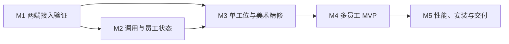

# DSH AI 工作室开发规划

版本：v1 · 制定日期：2026-09-11

本规划承接[产品构想文档](../DSH%203D%20AI%20工作室插件｜产品构想文档.md)第 29–30 节。视觉基准为用户已确认的“温暖微缩工作室”，产品目标是提供舒适、清晰的真实 AI 工作过程展示，并支持 DSH Web 和官方桌面。

本文规划后续工作，不表示相应功能已经实现。工期为初步工程估算；在目标宿主版本及接口验证完成后重新校准。

## 1. 当前起点

| 项目 | 当前状态 | 后续处理 |
|---|---|---|
| 产品定位、技术路线 | 已确认 | 以产品文档第 29–30 节为准 |
| 视觉概念图 | 已获用户认可 | 保留作为美术验收基准 |
| 3D 资产 v2 | 已完成美术精修迭代，待视觉验收 | 9 个独立模型及六工位场景；新增发型、木纹、织物、叶片与职业道具，保留 v1 对比 |
| 基础动画 | 已有演示动作 | Idle / Working / Error；刚性部件动画，尚无蒙皮骨骼 |
| 独立预览器 | 已有 | Three.js 展示、单资产查看、动作切换、GLB 下载 |
| 资产检查 | 已有首轮结果 | GLB 加载、顶点、包围盒和动画检查；本地 Chromium 预览检查 |
| DSH 插件骨架、真实事件、UI 挂载 | **Web 端已完成实测**（M1）；桌面端未验证 | 结论与证据见[接入能力验证结论](integration-findings.md) |
| 状态引擎 | 纯逻辑、归属解析、开发回放已实现，**56 项测试通过** | 断线恢复联调待完成 |
| 宿主状态桥接 | **已实现并实测**：事件 → 引擎 → 状态快照 → 客户端 | 见接入结论 §4.10–4.11 |
| 岗位化 3D 视图（六固定岗位） | **已实现并由用户目视确认** | 工位③⑤道具待换；见 §6.5、§7 |
| 模型自身活动（思维流） | **已实现并实测**（真实推理文本按调用归属） | 见接入结论 §4.11 |
| 交付纸（回答结束后的 A4） | **已实现并实测**（可滚动、印章收起） | 观感待用户确认 |
| 主题适配（明/暗） | **已实现**（跟随 `body[data-ds-dark-theme]`） | — |
| 多岗位收尾、设置持久化 | 未开始 | 见 §7（已按岗位化重写） |
| 正式性能与兼容性验收 | 未开始 | 需要真实宿主与明确设备基线 |
| 3D 资源送达浏览器 | **已解决**（走 `workspaceFiles` Remote 服务） | 见 `integration-findings.md` §4.9.3 |

**M1 已实测的关键约束**（详见[接入能力验证结论](integration-findings.md)）：

- 宿主为官方 npm 包 `@deepseek-ai/dsh@0.1.5-rc.1`，**不需要源码构建**。
- 宿主 React 版本为 **18.3.1** —— 3D 依赖必须按此匹配。
- UI 落位：`shell.overlay`（主场景）+ `sidebar.footer.action`（开关入口）。
- 13.20 MiB 的 `studio.glb` 经 Remote 层可送达浏览器并校验通过；`maxFileBytes` 上限 32 MiB。

当前组合场景来自 `assets/3d/v2/manifest.json`：438,286 个三角面、331 个网格、13,844,600 字节，约 13.20 MiB。本轮优先提高美术质量，后续需完成性能预算与资产压缩。网格数不等于最终渲染调用次数，现有体积和场景表现也不能证明几十个员工下的性能。

相关产物：[资产说明](../assets/3d/v2/README.md)、[资产清单](../assets/3d/v2/manifest.json)、[实际渲染](assets/studio-render-v2.png)、[已确认概念图](assets/studio-visual-reference-v1.png)。

## 2. 第一版交付范围

第一版以当前会话为观察范围，交付一个可以安装、查看真实活动并长期打开的工作室。

### 必须交付

- Web 与官方桌面均可安装、打开工作室，记录实际支持的宿主版本。
- 从宿主读取可展示插件或能力信息，建立工具到员工的明确归属；未知归属诚实显示。
- 根据实际员工集合生成工位，基础设施插件默认不占普通工位。
- 真实调用分别驱动员工活动；支持并发、完成、失败、取消和数据恢复。
- 员工状态、局部异常提示和简单活动强度。
- 点击员工查看当前任务、运行调用、当前会话调用次数和最近结果/错误。
- 保留用户喜欢的柔和色调、斜俯视角和亲和角色；动作平缓，不大面积闪烁。
- 减少动态效果、性能模式及关闭 3D 后的信息展示。
- 本地预编译安装包、安装说明、兼容矩阵及已知限制。

### 后续版本

全局工作室、完整任务回放、跨会话统计、插件安装/更新/禁用管理、复杂职业动作、成长系统、多主题及装修功能。第一版预留合理的数据边界，不提前开发这些功能。

## 3. 里程碑与顺序

| 里程碑 | 核心交付 | 预计工作日 | 前置条件 |
|---|---|---:|---|
| M1 接入验证 | 两端最小插件、真实事件面板、版本与能力清单 | 3–5 | 现有文档与测试环境 |
| M2 状态引擎 | 可复现的调用记录、员工状态、恢复及归属逻辑 | 3–4 | M1 确定事件契约 |
| M3 单工位产品原型 | 真实调用驱动一个员工，场景与角色首轮精修 | 5–7 | M1 确定界面和资产加载方式；M2 提供状态 |
| M4 多员工 MVP | 动态工位、详情面板、统计、活动强度、设置 | 4–6 | M3 功能与视觉验收 |
| M5 两端交付验收 | 性能优化、安装包验证、说明及演示 | 3–5 | M4 核心功能完整 |
| 合计 | 可安装 MVP，不含公开发布与后续版本 | 18–27 | 接口验证通过且不发生重大范围变化 |

按一名主要开发者全职投入、使用 AI 辅助开发估算；工作日表示工程投入，不能直接视为自动化运行时长。另留约 20% 缓冲，初步日历安排约 5–7 个工作周。缺少可验证桌面环境、需要宿主补充接口或完整重做角色绑定时，应单独评估增量，不能靠压缩测试消化。



M2 期间可以安排独立的模型精修；M3 的真实联调须等状态契约可用。优先保留每个阶段可以直接查看的产物，而不是积累到最后才展示。

## 4. M1：先证明插件能接入

### 工作项

- [x] **INT-01** 确认测试用 DSH Web 和桌面来源、版本及运行方式，建立独立测试环境，锁定源码提交或发行版本。
      实测用 `@deepseek-ai/dsh@0.1.5-rc.1`（npm 发行版，非源码构建）；参考源码锁定 `c291e7961a515f6d7af9304e7fd1d257929aef26`（0.1.5-rc.2）。两者存在 CLI 参数差异，已记录。
- [x] **INT-02** 建立最小 TypeScript 插件骨架，核对 React 共享依赖、客户端声明、编译与预编译打包方式。
      改为**纯 ESM 包**（`dsh.client` + 闭包工厂 bundle），实测无需 TypeScript 与打包链路即可运行；React 由宿主 `PLATFORM_MODULES` 提供，实测 **18.3.1**。见 §4.9.1。
- [x] **INT-03** 验证一个正式 UI 扩展入口，在两端显示简单面板并加载一个已有 GLB。
      **Web 端全部通过**：四个官方 slot（`shell.overlay`、`conversation.input.dock`、`conversation.composer.dock`、`sidebar.footer.action`）均注册并实际渲染；GLB 经 Remote 层取回并通过 magic 校验（§4.9）。**桌面端未验证。**
- [x] **INT-04** 采集开始执行、最终结果、取消、会话身份及嵌套调用信息，记录事件作用域与实际语义。
      成功 / 失败 / 取消 / 并发 / 会话身份全部拿到并有事件样本；**嵌套**拿到的形态是"子代理 = 独立会话"，parent token 属 PTC 模式，尚未触发（§4.4–4.5、§4.8）。
- [x] **INT-05** 分别检查已安装插件信息、当前可用工具信息和工具归属；缺失字段明确列为缺口。
      插件名册（`ctx.loader.entries()`，实测 89 条）与工具名册（`ctx.tools.schemas()`，实测 25 个）均可得；**运行时精确归属确认不可得**，改用官方生成式工具目录 + 三层求交，缺口已列为明确设计约束（§4.6）。
- [x] **INT-06** 验证插件卸载、后端重启和界面关闭时的清理行为，避免留下观察订阅或阻塞正常执行。
      卸载 fiber 后包装层与监听器**全部消失**，官方自动清理承诺实测成立（§4.7）。**DSH 设置界面的禁用入口未单独实测。**

### 交付与验收

交付一个最小安装包、事件观察面板、脱敏事件样本和 `docs/integration-findings.md`。报告记录测试版本、可用接口、已知差异和每项证据。

完成一次成功、一次失败、一次取消以及两个并发调用，面板能够正确区分调用和会话；Web 与桌面均出现面板并成功加载资产。

**完成情况（2026-09-11）：**

| 验收项 | 状态 |
|---|---|
| `docs/integration-findings.md`（含版本、可用接口、差异、证据） | ✅ 已交付，10 个小节 |
| 一次成功 + 一次失败调用 | ✅ 均已采集 |
| 一次取消调用 | ✅ 两种形态（进入时已中止 / 执行中取消）均已采集 |
| 两个并发调用 | ✅ 实测并发达 4 |
| 面板能区分调用与会话 | ✅ 区分并发、取消、跨会话 |
| **Web 端**出现面板并成功加载资产 | ✅ 四个 slot 渲染 + GLB 经 Remote 校验通过 |
| **桌面端**出现面板并成功加载资产 | ❌ **尚未验证**（无桌面环境） |

另交付：探针插件 `src/host/studio-probe.mjs`、客户端面板包 `packages/studio-panel/`，以及四套可复现的回归驱动（卸载清理 / 取消行为 / 挂载自检 / 资源探测）。

**阶段决策：** 若缺少可靠归属信息，先显示未归属工具并记录原因；若核心调用事件或 UI 接入不可用，先评估官方替代接口或宿主所需改动，再调整排期。桌面暂时无法启动时可继续不依赖它的工作，但 M1 的两端验证保持未完成。

## 5. M2：让状态可信

### 工作项

- [x] **STATE-01** 定义规范化事件和标识：会话、调用、父调用、工具、员工、时间及结果。
      已定义 5 类事件（`roster` / `connection` / `call-started` / `call-finished` / `call-result-only`）与 `OUTCOME`、`CONNECTION` 两套枚举。见 `src/shared/state-engine.mjs`。父调用标识暂未纳入——嵌套实测形态是"子代理 = 独立会话"，parent token 属 PTC 模式且尚未触发（见接入结论 §4.5）。
- [x] **STATE-02** 实现调用记录集合和员工派生状态，运行集合、错误记录、连接状态分别保存。
      调用记录、会话统计、连接状态、未归属工具记账分别保存；员工状态由 `employeesOf(state, sessionId)` 按会话派生。
- [x] **STATE-03** 实现重复通知去重、先收到结束事件的处理、取消、状态快照替换和会话切换。
      用例 3、4、5、6、7、8 逐条覆盖并全部通过（`tests/state/state-engine.test.mjs`）。
- [x] **STATE-04** 建立工具归属解析与未知归属路径；同一插件多个工具汇总到同一员工。
      `src/shared/employee-resolver.mjs` 将官方目录、实际工具名册与启用插件求交；支持别名，同名多包或多实例不猜归属；基础设施不建空工位。宿主运行时名册桥接待接入。
- [x] **STATE-05** 提供模拟输入与记录重放入口，输入输出可重复验证；当前只用于开发测试，不做用户回放功能。
      `npm run state:replay` 可运行默认输入或传入 JSON 文件；每轮使用独立状态与固定事件时钟。示例见 `tests/fixtures/studio-replay.json`。

2026-09-11 本轮验证：`npm test` 18/18 通过，开发回放通过。修复完成事件的运行数递减、活动量跨会话隔离、员工调用次数、孤立结果取消信号与快照统计引用。此结果只覆盖纯逻辑，不能替代真实宿主事件、断线恢复与两端验收。

### 交付与验收

交付无渲染依赖的 TypeScript 状态模块、规范化类型和有明确预期结果的事件用例。

| 用例 | 预期表现 |
|---|---|
| 三个并发调用完成一个 | 员工仍工作，运行数变为两个 |
| 一个调用失败，另一个继续 | 继续工作并保留局部错误提示 |
| 同一完成通知到达两次 | 调用次数与结果不重复计算 |
| 开始事件缺失，先收到结束事件 | 保留可确认结果，缺失耗时显示未知，不虚构开始时间 |
| 用户取消调用 | 单独记录取消，不计为成功 |
| 断开数据连接 | 显示断开/未知，不把员工全部改成完成 |
| 重新连接 | 依据权威基线恢复，旧快照与新事件不交叉污染 |
| 切换会话或同名工具跨会话运行 | 员工活动和统计不串线 |

## 6. M3：一个工位达到产品效果

### 工作项

- [~] **VIS-01** 将独立预览中的场景能力封装为 React 组件，保留原预览器用于资产比对。
      **部分完成**：场景已封装为 React 组件（`packages/studio-panel/src/client/index.mjs`），原预览器保留。
      **刻意不用 R3F**：宿主 React 锁定 18.3.1，R3F 需与宿主 reconciler 严格匹配，当前场景简单，直接用 Three.js 风险更低。
- [~] **VIS-02** 定义房间、工位、员工的资产坐标与定位点，独立实例播放动作，避免全场同时切换。
      **动画部分完成**：资产实测 Idle/Working/Error 三段剪辑**同时作用于全部 6 名员工**（轨道名 `Employee_3_Head.quaternion` 这种），
      已按员工前缀过滤轨道、每人各自成一个剪辑，由真实状态独立驱动，不再全场一起切动作。
      **未完成**：工位坐标仍沿用资产里烘焙好的 `Station_0..5`，没有独立坐标表——M4 动态布局需要补。
- [~] **VIS-03** 精修角色头发、面部、服装和手部；修正桌椅接触关系及动画中的穿插。
      **已完成**：六个座位按姿势各有动作（打字 / 翻读卷宗 / 端起咖啡），逐个员工量过幅度（4.9°–6.3°），
      不达标会让 `assets:verify` 失败（门禁 ≥0.04）。
      **未完成**：穿插只能目视确认，需用户在实际视角下检查手/桌/椅/脸；工位③⑤的道具与职责不匹配。
- [x] **VIS-04** 调整光照、材质、阴影、植物与道具疏密，使实际渲染接近已确认概念图。
      **由用户完成**：`src/shared/studio-lighting.mjs`（半球光 + 主光 2048 阴影 + 六盏顶灯 + 日夜跟随）、
      `src/shared/studio-art.mjs` + `assets/art/studio-v1/`（窗景日/夜、挂画、chibi、标语，经 Remote 载入并逐个释放）、
      `src/shared/studio-camera.mjs`（正交投影、仰角 34°、方位 −38°）。
- [x] **VIS-05** 接入真实员工状态、轻缓动作过渡、选中反馈与最小详情面板。
      **真实状态接入**：宿主桥接 → 状态快照 → 工位动作（真实调用已验证：成功调用点亮 `tool-fs` 并落座）；
      过渡用 0.35s 淡入淡出。
      **选中反馈**：射线拾取员工/桌/椅 → `BoxHelper` 鼠尾草色线框高亮，再点同一位取消。
      **最小详情面板**：工位号、员工与归属、当前任务、运行中调用数、本会话成功/失败/取消计数、
      最近结果与最近错误；缺失项写"未知"，不用零代替。
      **降级路径**：页面隐藏时降频 1fps（对应 REL-03 的暂停绘制），不把画面冻死。
- [~] **VIS-04 前置（已提前处理）**：实机验收发现 `Working` 动作幅度只有约 2°（与 Idle 同量级），
      状态已切到 working 但肉眼看不到动作。已在 `scripts/asset-kit-v2.mjs` 把双臂起落放大到约 14°
      （另加躯干前倾与低头、Idle 呼吸约 2 倍），并在 `scripts/verify-assets.mjs` 增加**幅度下限门禁**
      （`Working`/`Error` ≥ 0.04，原门禁阈值 1e-5 形同虚设）。
- [ ] **VIS-06** 添加减少动态效果；仅在实测需要时升级角色绑定，不将全部动作重做作为默认前提。
      **用户明确决定暂不实现**（原话："不做这个，我们就是要把最好的展现出来"）→ 记为**延后到发布前**；
      它仍是第一版必须交付项，不静默丢弃。开场动画已按 `prefers-reduced-motion` 做了一处礼貌处理。

> **M3 状态（2026-09-11 收尾）：** 宿主桥接、状态驱动、六固定岗位、思维流气泡、交付纸、主题适配均已实现并实测；
> 56 项纯逻辑测试通过；**真实调用与渲染效果已由用户目视确认**（Working 动作、岗位分工、气泡、交付纸）。
> 剩余：工位③⑤道具、穿插精修、10 分钟连续观察。

### 交付与验收

交付一个可在两端运行的单工位插件原型、精修资产 v2、与概念图同视角的截图，以及短时运行录屏。

- 开始调用后员工工作，调用真正全部结束后恢复；错误清楚可见。
- 关闭或切换界面后重新打开，不丢失真实工作状态。
- 在默认视角、近景、缩放和工作动画下检查手部、衣服、椅子、桌面穿插。
- 标签不挡住脸部和主要道具；错误不只依赖红色表达。
- 连续观察至少 10 分钟，检查重复动作、镜头、闪烁和视线疲劳；记录用户对实际画面的反馈。

**阶段门槛：** 视觉基准是已确认概念图。现有 v1 GLB 是开发起点，不能因为已经导出就视为完成美术验收。视觉与真实状态均通过后再复制到多工位。

## 6.5 范围扩展：模型自身的活动（2026-09-11 用户提出）

**需求：** 只把插件画成员工不够，**模型自己的读取、编写、思维流**也要能体现出来。

**世界观补一条（与既有"插件=员工"并存）：** 工作室里有**两类角色**——
插件是员工（占工位），**模型本人是中央总控台上的协调员**（资产里本来就有 `Console` + `Coordinator` 机器人，
位置正好在房间中央）。协调员思考、撰写、派活；员工接活、执行、回报。这条不违背产品文档第 29–30 节，
只是把"AI 的工作过程"补齐到模型这一层。

**数据可行性已实测**（见[接入结论](integration-findings.md) §4.11）：`agent/assistant-stream` 可实时订阅，
拿到 `reasoning-delta`（思维）/ `text-delta`（编写）/ `tool-call-delta`（派活）/ `usage`（输入、输出、思维 token）；
`session/event` 提供轮次、步骤、失败重试边界。

**已实现（本轮）：** 纯逻辑累积器 + 单测；快照 `model` 段；面板显示阶段/轮次/token/思维流尾巴；
总控台机器人按阶段做程序化动作。

**岗位固定化（2026-09-11 用户要求，已实现）**：六个工位职责固定，工位 i 恒等于岗位 i ——
**①资料检索 ②撰写修改 ③命令执行 ④协作调度 ⑤联网调查 ⑥会话记忆**（`src/shared/studio-posts.mjs`）。

同时按用户要求改掉了表述口径：**岗位显示的是"正在做某件事"（现在进行时），不是统计数字**。
文案由**真实调用的参数**推出（`tool/call` 与 `tools/execute` 都带参数），例如
「正在联网调查：cordis 插件」「正在翻查资料：package.json」；拿不到参数时只报岗位动词，
不编细节；未收录的工具另列"未归类工具"，不硬塞进岗位。计数降为次要信息垫在末尾。
插件由此退为岗位里的「承包方」——座位不再依赖插件发现，"未落座/溢出/空工位"整类问题消失。

**待做（建议排在 M4 之前或并行）：**
- ③命令执行、⑤联网调查两个岗位的现有道具（文档屏、数位板）与职责不匹配，需要换道具。
- "正在做某事"目前只在面板文字里，**还没有浮在员工头顶**（3D 内标签）。
- 读取与编写目前只是数字，缺少空间表现（例如资料架/档案往返、屏幕输出）。
- 思维流做成字幕或打字机效果（数据里本来就带逐块计时 `dt[]`，可以真实还原节奏）。
- 失败重试（`assistant/attempt`）需要单独的历史呈现，不能只靠一个"重试中"阶段。
- 总控台目前是程序化动作；若观感不足，需要为该机器人单独做动作剪辑（计入 VIS-03 类资产工作）。

## 7. M4：岗位化之后的收尾

> **2026-09-11 修订。** 本节原按"插件 = 员工、一人一座"写的（按员工名单排位、0/1/5/10/20 人分页）。
> 用户随后把工位改成**六个固定岗位**：工位 = 岗位，插件退为岗位里的「承包方」，不再占座。
> 于是"人多到坐不下"这个前提消失，"多员工"的含义随之改变。**原文保留在本节末尾作为历史，不再作为开发依据。**

### 工作项（按新前提重定义）

- [ ] **MVP-01 未归类工具的呈现**：不属于六个岗位的工具（第三方插件等）目前只在状态面板里列一行，
      **房间里看不到它们**。需要在场景里给一个位置（例如共享工区/散座），并且**不伪装成具名岗位**。
- [ ] **MVP-02 岗位内的并发呈现**：一个岗位同时跑多件事时，现在只显示第一件 +「同时还有 N 件」。
      需要更好的表达；且不得把它称为"负载"或"进度"（产品文档第二原则）。
- [ ] **MVP-03 详情面板补插件维度**：点岗位 → 该岗位上有哪几个插件在承包、各自的调用与成败分布。
- [ ] **MVP-04 异常与降级**：数据断开、资源加载失败、关闭 3D 后的**纯列表**展示。
- [ ] **MVP-05 工位③⑤的道具**：③联网调查席（现为设计席的数位板 → 资料台/地球仪）、
      ⑤命令执行席（现为文档席的文档屏 → 终端屏）。这属于资产工作，可与美术并行。

### 交付与验收

至少使用**两类实际工具**执行一个完整任务，岗位、详情面板与真实调用记录一致
（现有「资料检索 + 联网调查」可同时发生，已具备条件）。
3 秒内识别"谁在干活"、10 秒内定位错误，做实际观察并记录结果，不只依据开发者主观判断。

### 历史原文（已被上面的前提取代）

- MVP-01 根据员工名单生成布局；稳定员工标识对应稳定位置，增减员工尽量减少跳位。
- MVP-02 验证 0、1、5、10、20 名员工下的显示；超出同屏舒适容量时采用分页或分区浏览，所有员工仍可找到。
- MVP-03 提供职业配色与研究、编程、设计、文档道具，未匹配类型使用通用工位。
- MVP-04 完成员工详情、当前任务、运行调用、会话次数和最近结果/错误。
- MVP-05 实现简单活动强度与平滑视觉反馈，界面不把它称为真实资源负载或任务进度。
- MVP-06 完成空状态、未知归属、数据断开、资源加载失败及关闭 3D 后的列表展示。
- MVP-07 保存必要的个人显示设置：镜头、减少动态效果、性能模式、是否启用 3D；业务状态仍以宿主为准。

原验收：交付多工位 MVP；小窗口下标签和详情可读；较多员工时不通过无限缩小人物勉强塞入一屏。

## 8. M5：性能、兼容性与安装交付

### 工作项

- [ ] **REL-01** 在确定设备上记录无插件、只启用数据层、打开 3D 三种状态下的性能，区分采集开销与渲染开销。
- [ ] **REL-02** 检查 1、5、10、20 员工场景；按实测优化材质合并、几何共享、对象实例、阴影及分辨率。
- [ ] **REL-03** 验证页面隐藏暂停绘制、静止按需绘制、减少动态效果与 3D 降级路径。
- [ ] **REL-04** 从干净环境安装预编译包，验证启动、启用、关闭、卸载和再次安装；确认资源不依赖开发机绝对路径或预览服务器。
- [ ] **REL-05** 完成版本矩阵、已知限制、安装说明、资产来源及第三方依赖许可记录。
- [ ] **REL-06** 产出本地候选发布包、截图和真实任务演示；公开发布在发布对象和渠道确定后另行执行。

### 建议性能目标

下列数值是初始验收目标，不是已经测得的结果。在 M1 确定测试设备，在 M3 根据实测明确最终口径。

| 指标 | 初始目标与测量方式 |
|---|---|
| 标准模式 | 同屏 5 员工持续工作场景，交互期间帧率目标不低于 30 FPS；记录帧时间分布 |
| 数据到画面 | 从适配层收到事件至状态可见，P95 目标不超过 250 ms；不包含宿主或网络传输时间 |
| 后台渲染 | 页面隐藏后不持续提交 WebGL 帧，数据观察不因此误判任务结束 |
| 资源生命周期 | 连续打开/关闭工作室 20 次，观察器、定时器和 GPU 资源无累计残留 |
| 长时间运行 | 30 分钟代表性任务序列，完成调用记录按明确策略保留或裁剪，内存无持续异常增长 |
| 宿主影响 | 同一可重复任务对比关闭/开启观察层的耗时分布，无显著退化；报告实测而非仅看动画流畅度 |

### 兼容验证矩阵

| 环境 | 验证重点 | 当前状态 |
|---|---|---|
| 本地 Windows + Chromium 资产预览 | 资产加载与演示动画 | 已有首轮结果；不能替代插件验收 |
| Windows 上目标版本 DSH Web | 安装、UI、事件、状态恢复、资源加载 | 待验证 |
| Windows 上匹配版本官方桌面 | 插件安装路径、共享依赖、通信与资源、卸载重启 | 待验证 |
| macOS 官方桌面及其他浏览器 | 实际设备回归 | 后续具备环境后验证；未测前不宣称支持已通过 |

桌面源码开发启动与桌面安装包运行分别记录。没有完成其中某项时如实保留未验证状态，不用“共用 Web UI”替代验收。

## 9. 代码与资产组织

现有资产、截图与独立预览器继续保留。接入阶段逐步增加以下模块，不先为拆包而建立复杂仓库结构。

```text
src/
  host/          DSH 事件订阅、能力发现、服务与生命周期
  shared/        事件与状态类型、纯 TypeScript 状态逻辑
  client/        客户端数据适配、React 面板、3D 组件
  client/scene/  房间、工位、员工、动画与镜头
tests/
  fixtures/      脱敏事件序列
  state/         并发、取消、重复通知和恢复用例
  integration/   两端最小组合与真实调用验收
assets/3d/
  v1/            已有首版，保留用于对照
  v2/            后续精修资产
preview/         独立资产预览与模拟工作场景
scripts/         构建、导出、检查、打包
docs/            产品、规划、接入结论和验收记录
```

生产构建遵循选定宿主版本的插件契约。现有资产工程使用的 Three.js 版本是预览依赖；迁入产品时核对 React / R3F / Three.js 兼容组合后统一锁定。

## 10. 风险与处理

| 风险 | 最早验证点 | 处理方式 |
|---|---|---|
| 工具无法可靠归属插件 | M1 | 明确未知归属，补充元数据或适配；不通过名称猜测掩盖问题 |
| 桌面 UI 或资源接口与 Web 不同 | M1 | 优先官方共同接口，必要时局部适配并保留差异记录 |
| DSH 接口快速变化 | M1 起 | 固定验证版本，适配层隔离；升级另做回归 |
| 实际 3D 与概念图观感差距 | M3 | 单工位先精修、比对；将精修时间计入开发，不以功能替代视觉验收 |
| 人物数量增多后拥挤或变慢 | M4 | 舒适同屏容量、分页/分区、资源共享和性能模式 |
| 订阅、动画与 GPU 资源泄漏 | M2–M5 | 明确所有权与释放流程，反复开关和长时间运行测试 |
| 统计因历史窗口不完整而误导 | M2 | 区分当前运行状态与历史统计范围，不把未知补为零 |
| 测试素材包含私密信息 | M1 | 使用受控测试任务，提交前脱敏事件样本，默认只展示必要摘要 |

## 11. 下一轮可以直接执行的任务

下一轮聚焦 M1，产出一个可以实际安装和观察的最小插件：

1. 核对现有 DSH 安装及官方源码，确定 Web/桌面测试版本和独立环境。
2. 写出最小插件清单、构建配置和 UI 入口。
3. 在面板中显示真实调用生命周期和会话身份。
4. 将现有 `desk.glb` 或 `employee.glb` 放进面板，验证两端资产加载。
5. 用成功、失败、取消、并发任务记录结果，形成接入能力清单。

该轮完成后即可确定：数据是否足够、员工如何归属、工作室放在哪里、两端需要哪些适配，以及后续排期是否需要调整。

## 12. MVP 完成标准

- [ ] 用户可按说明在已声明版本的 Web 与桌面安装并打开工作室。
- [ ] 真实调用与员工状态一致，覆盖并发、失败、取消和恢复。
- [ ] 当前会话统计范围清楚，未知信息明确显示。
- [ ] 实际 3D 达到已确认的温暖、柔和、清楚的视觉方向。
- [ ] 同屏容量、性能模式、减少动态效果和无 3D 路径经过验证。
- [ ] 安装包包含运行所需资源，测试与开发专用数据不进入用户工作流。
- [ ] 两端验收证据、已知限制和后续待办随候选发布包交付。

状态更新以已完成交付和验证证据为依据。修改范围或目标版本时同步调整本规划，不只修改预计时间。

## 13. 收尾记录（2026-09-11）

本轮到此收尾。以下只列**已有证据**的事；没有验证过的一律标未验证。

### 本轮交付

| 交付物 | 证据 |
|---|---|
| 宿主状态桥接（事件 → 引擎 → 快照） | 真实 headless 调用实测：成功调用归属 `tool-fs` 并落座；合成调用覆盖失败/取消/并发 |
| 六个固定岗位（工位 = 岗位） | 工位 i 恒等于岗位 i；插件退为「承包方」；用户目视确认 |
| 「正在做某事」而非统计 | 文案由**真实参数**推出（`正在联网调查：<url>`）；未收录工具另列"未归类"，不硬塞 |
| 思维流气泡（含按调用归属） | 真实推理文本：`资料检索 | 正在翻查资料：package.json | 思维：The user wants me to read…` |
| 交付纸（A4，可滚动） | 真实调用实测；**一次回答只交付一份**（`assistant/message` 是每步都发的，改为 `turn/end` 时才落成）；用户目视确认 |
| 员工日志（原状态面板） | 事件流（时间·岗位·动作·终态·耗时·错误）+ 交付，倒序；**头部固定、主体单独滚动**（用户反馈"收起按钮要往上滑才能点"） |
| 汇报记录（右上角） | 默认收起、点开列出**全部**、点别处收回；放不下时面板内滚动 + 「⌄ 可滚动」提示（不显滚动条） |
| 汇报记录的历史回填 | 宿主侧 `ctx.sessions.list()` → `Session.snapshotEvents()` 读**完整日志**回填；实测 `delivery-seed · harvested 12 · added 12`，快照保留 10 份真实历史回答 |
| 主题适配（明/暗） | 变量表单一来源；产物内除滑杆强调色外无写死颜色 |
| 相机取景（正交、按屏幕空间拟合） | Node 数值验证：各宽高比下 max\|NDC\| ≤ 0.909、质心 0 |
| 容器尺寸变化重排 | `ResizeObserver`；诊断行给"缓冲 ≈ 容器 × dpr"判据 |
| 纯逻辑测试 | **65 项全绿**（`npm test`） |
| 资产校验 + 动作幅度门禁 | `npm run assets:verify`：10 个 GLB 通过；`Working`/`Error` 幅度 ≥ 0.04 |

### 未验证（不要当作通过）

- **桌面端**：从未有过可用环境，M1 起一直标注未验证。
- **真人目视项**：动作穿插（手/桌/椅/脸）、交付纸排版与字号、气泡避让的边界情况。
- **性能**：从未测量（REL-01/02）；13.2 MiB 资产、438,286 三角面只测过"能送达"。
- **长时间观察**：10 分钟连续运行的重复动作/闪烁/疲劳未做。
- **安装交付**：包已能装（四条阻塞全解），但**真机跨机器**的安装/卸载/重装未跑：会写用户 profile，留给用户执行；
  已验证到「tarball 被 pnpm 正常安装、资源齐备、不需要 `prepare`」。

### 打包（2026-09-11 已处理四条阻塞）

包已产出：`npm pack` → `dsh-studio-panel-0.1.0.tgz`（**15.2 MB**，解包 23.8 MB，23 个文件）。

- `dsh.bundle.patch` 指向包内 `cordis.patch.yml`（用**包名**引用，官方 bundle 同惯例）；
- `src/shared/*` 与宿主桥接**已收进包内**；开发专用件（probe、selftest、图自检、replay）留在仓库；
- 状态文件改到**用户目录** `<home>/.dsh/studio/state.json`；资源路径由**宿主按包位置解析**写进快照；
- **可移植性（收尾时补的一层）**：客户端产物曾把构建机绝对路径烤进去，包只能在打包那台机器上工作。
  现在宿主把快照**同时**写一份到**会话工作区** `<cwd>/.dsh-studio/state.json`，客户端用**工作区相对路径**
  引导（`workspaceFiles` 按会话 `header.cwd` 解析），产物里三个路径注入值一律 `null`——
  **包内不含任何机器相关路径**。副本**只写 live 会话 cwd + sandbox 工作区根（上限 3）**：
  中间试过按 `sessionPersistence.list()` 把存储态会话的 cwd 也全覆盖，实测一次启动污染用户 8 个无关项目目录，已回退。
  验收：`bridge-selftest` 10 项全过 + **真浏览器打开新版客户端**看到画布挂载、员工日志 10 条真实交付、无错误文案
  （见[打包清单](打包清单.md) ③ 的收尾实测）；
- 包内**不含**设计文档、测试、脚本与开发工具（用户明确要求）；
- 许可 MIT + `THIRD-PARTY-NOTICES.md`（three.js 的 MIT 原文）随包分发。

**仍未验证**：实际 `dsh plugin add` 安装/卸载/重装（会写用户 profile，需用户执行）、桌面端、
以及**换一台机器/换账号**后的目视确认（本环境只有一台机器）。
**逐条细节见[打包清单](打包清单.md)。**

声明状态：**MIT**（`Copyright (c) 2026 浊客er`）；`THIRD-PARTY-NOTICES.md` 已建（three.js MIT 原文 + esbuild +
官方包说明 + 资产来源）；产物头部已加许可指引；`assets/art/studio-v1/*.png` 已确认**项目作者自制**。

### 如何运行（开发态）

```bash
PATH="/c/Users/LAI/.workbuddy/binaries/node/versions/22.22.2-2:$PATH" npx --yes @deepseek-ai/dsh@0.1.5-rc.1   --profile web --patch "L:/Toolfolk for DSH/packages/studio-panel/cordis.yml"   --port 3081 --no-open
# 用启动输出里带 ?token= 的完整地址打开，切到「3D 工作室」
```

**环境约束**：必须用托管版 Node 22（系统 Node 24 实测无输出挂住）；宿主必须用**默认 npm 缓存**——
`--cache` 指向项目 `tmp` 会生成含重复副本的模块树，把 `~/.dsh` 的 profile 软链带坏（见接入结论 §5.6）。

### 一句话状态

**功能已经齐了，包也能装**：真实事件驱动六个固定岗位、思维流气泡、交付纸、员工日志、汇报记录（含历史回填）、
明暗主题；产物内不含机器相关路径，可交给别人安装。**仍缺的是"别人机器上真的跑一遍"的目视确认**（桌面端、跨机器、长时间观察）。

### 下一步（按优先级）

1. **真机验收**：在另一台机器/另一个账号上 `dsh plugin add` tarball → 目视确认工作室正常（这是唯一还没过的硬关口）。
2. **M4 五项收尾**（§7）：未归类工具的呈现、岗位内并发、详情面板插件维度、异常与降级、工位③⑤道具。
3. **性能测量**（REL-01/02）：几何占 12.56 MiB（95%），是唯一值得优化的地方。
4. 桌面端验证：需要一台可用环境，否则保持"未验证"。
